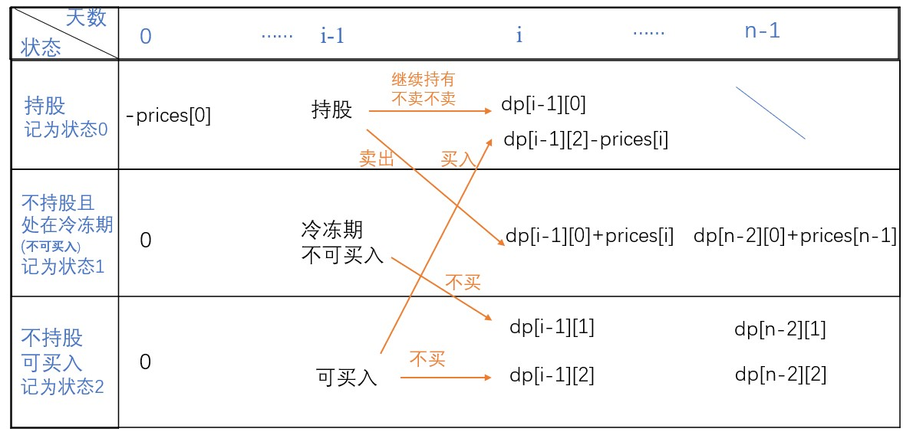

# 309.最佳买卖股票时机含冷冻期

## 题目
给定一个整数数组，其中第 i 个元素代表了第 i 天的股票价格 。​

设计一个算法计算出最大利润。在满足以下约束条件下，你可以尽可能地完成更多的交易（多次买卖一支股票）:

你不能同时参与多笔交易（你必须在再次购买前出售掉之前的股票）。
卖出股票后，你无法在第二天买入股票 (即冷冻期为 1 天)。

    示例:
    输入: [1,2,3,0,2]
    输出: 3 
    解释: 对应的交易状态为: [买入, 卖出, 冷冻期, 买入, 卖出]

## 方法（二维DP）
### 1.状态定义
通过分析题意，我们可以将所有状态归结为以下三种（分别记为状态1、2、3）:

1. 持股
2. 不持股且在冷冻期（不能买入）
3. 不持股且不在冷冻期（能买入）

返回值的状态由两个参数决定（天数和状态），因此这是一个二维DP的问题。

**定义dp[i][j]为在第i天状态为j时的最大收益**

### 2.Base Case
在第0天只有买入和不买入的两种操作，不可能存在卖出（因为不可能在第0天前买入0。
* 如果第0天买入，即持股，对应状态0，花费了prices[0]。于是$dp[0][0] = -prices[0]$;
* 如果第0天不买入，即不持股，对应状态1、2。不花钱不赚钱。于是$dp[0][1]=dp[0][2]=0$

### 3.状态转移方程
* 持股状态可以由两种情况转换来：
  1. 昨天持股，今天不卖
  2. 昨天不持股且非冷冻期，今天买入
* 冷冻期状态只能由以下一种情况转换来：
  * 昨天持股，今天卖出
* 不持股且不在冷冻期状态可以由两种情况转换来：
  * 昨天处在冷冻期，今天不能买
  * 昨天不持股且不在冷冻期，今天可以买但是偏偏不买
  
具体转换过程如下图所示：



注意：在最后一天(第i-1天）时，一定不能持股，无论什么价位都要卖出，不然会亏。即在最后一天时的持股状态不可能产生最大收益。因此最大收益应该为最后一天时不持股和冷冻期这两种状态的较大者。
## 代码
```java
public int maxProfit(int[] prices) {
    if(prices == null || prices.length <= 1)
        return 0;
    int n = prices.length;
    int[][] dp = new int[n][3];
    //设置base case
    dp[0][0] = -prices[0];
    dp[0][1] = 0;
    dp[0][2] = 0;
    for(int i = 1; i < n; i++){
        dp[i][0] = Math.max(dp[i - 1][0], dp[i - 1][2] - prices[i]);
        dp[i][1] = dp[i - 1][0] + prices[i];
        dp[i][2] = Math.max(dp[i - 1][1], dp[i - 1][2]);
    }
    return Math.max(dp[n - 2][0] + prices[n - 1], Math.max(dp[n - 2][1], dp[n - 2][2]));
}
```

* 时间复杂度：O(n)
* 空间复杂度：O(n)

## 优化空间复杂度
由于第i天的状态只与第i-1天的状态有关，因此我们可以用如下方式降低空间复杂度。
```java
public int maxProfit(int[] prices) {
    if(prices == null || prices.length <= 1)
        return 0;
    int n = prices.length;
    //设置base case
    int dp0 = -prices[0];
    int dp1 = 0;
    int dp2 = 0;
    for(int i = 1; i < n; i++){
        int new1 = Math.max(dp0, dp2 - prices[i]);
        int new2 = dp0 + prices[i];
        int new3 = Math.max(dp1, dp2);
        dp0 = new1;
        dp1 = new2;
        dp2 = new3;
    }
    return Math.max(dp0 + prices[n - 1], Math.max(dp1, dp2));
}
```

* 时间复杂度：O(n)
* 空间复杂度：O(1)

## 参考
* [leetcode题解区](https://leetcode-cn.com/problems/best-time-to-buy-and-sell-stock-with-cooldown/solution/yi-tu-miao-dong-jie-fa-by-zi-gei-zi-zu/)