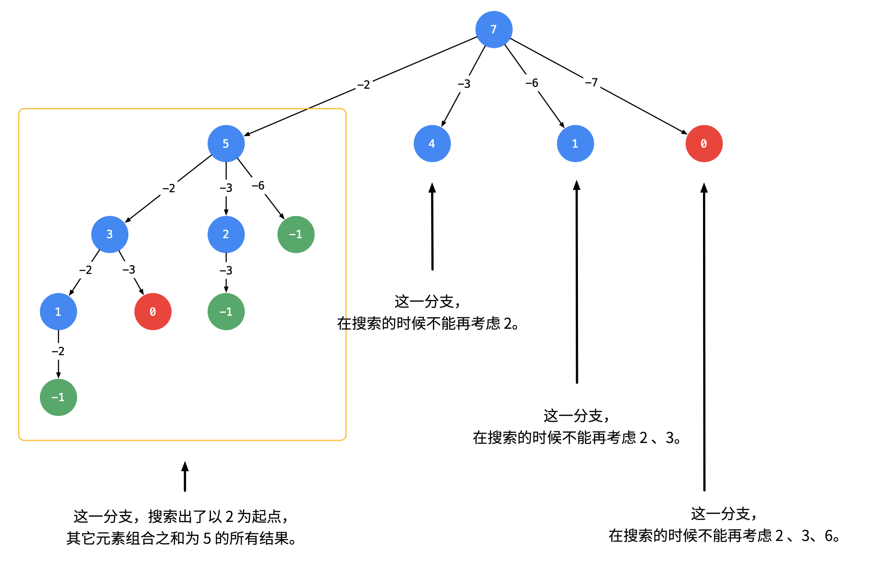

# 39.组合总和

## 题目

给定一个无重复元素的数组 candidates 和一个目标数 target ，找出 candidates 中所有可以使数字和为 target 的组合。

candidates 中的数字可以无限制重复被选取。

说明：  
 所有数字（包括 target）都是正整数。  
 解集不能包含重复的组合。 

    示例 1：
    输入：candidates = [2,3,6,7], target = 7,
    所求解集为：
    [
    [7],
    [2,2,3]
    ]

    示例 2：
    输入：candidates = [2,3,5], target = 8,
    所求解集为：
    [
      [2,2,2,2],
      [2,3,3],
      [3,5]
    ]

## 方法（回溯法）
对于回溯法，需要重点考虑三个问题：
* 路径：目前为止已经做出的选择
* 选择列表：当前可以做的选择
* 结束条件：到达决策树的叶节点时，无法再继续做选择，结束。

以上述的示例1为例，画出本题的决策树如下（引用自[liweiwei1419的leetcode题解](https://leetcode-cn.com/problems/combination-sum/solution/hui-su-suan-fa-jian-zhi-python-dai-ma-java-dai-m-2/)）


在分支箭头上的数字表示已经做出的选择，即路径。节点中的数字表示当前的target。当target为0时，即找到了一个正确路径。

以上的决策树有4个为0的叶节点，按理说结果数组中应该有4个路径[2, 2, 3], [2, 3, 2], [3, 2, 2], [7]。但是正确的输出只包含两个[2, 2, 3][7]。可以发现原来是[2, 2, 3], [2, 3, 2], [3, 2, 2]这三个路径中的元素相同，而题目要求的解中不应包含重复的组合。

为什么会产生重复呢？  
题目中说candidates中的数字可以无限制重复被选取。因此我们在每一个节点做选择的时候，考虑了所有的候选数。比如说在节点4处，即使该层的上一个节点5搜索过包括2的全部的情况，在4处做选择的时候，依然可以选择2。造成了重复。

因此我们要在搜索的过程中就进行去重操作：具体的做法是：在每一次做选择的时候，设置一个选择的起点start，只能选择candidants数组中start及其之后的元素。

如下图所示：即从每一层的第 2 个结点开始，都不能再搜索产生同一层结点已经使用过的 candidate 里的元素。（引用自[liweiwei1419的leetcode题解](https://leetcode-cn.com/problems/combination-sum/solution/hui-su-suan-fa-jian-zhi-python-dai-ma-java-dai-m-2/)）



### used数组和start变量适用情况的区别：
（引用自[liweiwei1419的leetcode题解](https://leetcode-cn.com/problems/combination-sum/solution/hui-su-suan-fa-jian-zhi-python-dai-ma-java-dai-m-2/)）
* 排列问题，讲究顺序（即 [2, 2, 3] 与 [2, 3, 2] 视为不同列表时），需要记录哪些数字已经使用过，此时用 used 数组；
* 组合问题，不讲究顺序（即 [2, 2, 3] 与 [2, 3, 2] 视为相同列表时），需要按照某种顺序搜索，此时使用 start 变量。

补充：used数组用在元素只能使用一次的情况下，而当遍历到一个元素时，如果只需要向后搜索其后面的元素，不再需要考虑前面的元素时，用start变量。

在理清上述的逻辑之后，我们下一步考虑剪枝操作：我们先对数组candidates排序，则排序后candidates[start]即为我们当前可以选择的最小的元素。如果target小于candidates[start]，那么即使我们选择最小的那个元素，下一步的target都会产生一个负数，不可能得到正确的组合，因此直接返回。


## 代码
```java
class Solution {
    List<List<Integer>> res = new ArrayList<>();
    List<Integer> path = new ArrayList<>();
    public List<List<Integer>> combinationSum(int[] candidates, int target) {
        Arrays.sort(candidates);
        backtrack(candidates, 0, target);
        return res;
    }

    public void backtrack(int[] candidates, int start, int target){
        if(target == 0){
            res.add(new ArrayList<>(path));
            return;
        }
        //剪枝操作
        if(target < candidates[start])
            return;
        for(int i = start; i < candidates.length; i++){
            //进行选择
            path.add(candidates[i]);
            //根据做出的选择，进入下一个节点
            //这里的start参数之所以是i而不是i+1，是因为即使选择了candidates[i]，在不同层的下一个节点依然可以再重复地选择它。
            backtrack(candidates, i, target - candidates[i]);
            //撤销选择
            path.remove(path.size() - 1);
        }
    }
}
```

# 40.组合总和 II

给定一个数组 candidates 和一个目标数 target ，找出 candidates 中所有可以使数字和为 target 的组合。

candidates 中的每个数字在每个组合中只能使用一次。

    说明：
    所有数字（包括目标数）都是正整数。
    解集不能包含重复的组合。 

    示例 1:
    输入: candidates = [10,1,2,7,6,1,5], target = 8,
    所求解集为:
    [
    [1, 7],
    [1, 2, 5],
    [2, 6],
    [1, 1, 6]
    ]

## 方法
这道题同时满足：
* 在一个组合中，candidates中的每个数字只能使用一次。
* 组合问题：例如：数组[1,2,3]，遍历到1时，包含1的所有结果已经被搜索完毕。遍历到2时就不需要再考虑前面的1，只需要向后搜索即可.

因此需要同时使用used数组和start变量。

而给定的candidates数组中包含重复变量，为了避免重复的结果。必须先排序后再剪枝，具体的剪枝操作为：遇到决策树中同一层中的相同元素时，剪枝。

```java
class Solution {
    List<List<Integer>> res = new LinkedList<>();
    int[] candidates;
    int target;
    boolean[] used;
    public List<List<Integer>> combinationSum2(int[] candidates, int target) {
        this.candidates = candidates;
        this.target = target;
        this.used = new boolean[candidates.length];
        //排序使得重复的元素彼此相邻
        Arrays.sort(candidates);
        backtrack(0, new LinkedList<>(), 0);
        return res;
    }

    public void backtrack(int start, List<Integer> path, int sum){
        //以下两个if判断为终止条件
        if(sum == target){
            res.add(new LinkedList<>(path));
            return;
        }
        if(start == candidates.length)
            return;
        //以下if判断为剪枝操作
        if(sum > target || candidates[start] > target - sum)
            return;
        for(int i = start; i < candidates.length; i++){
            //当重复的元素在决策树的同一层时，剪枝
            if(i - 1 >= 0 && candidates[i] == candidates[i - 1] && !used[i - 1])
                continue;
            path.add(candidates[i]);
            used[i] = true;
            backtrack(i + 1, path, sum + candidates[i]);
            path.remove(path.size() - 1);
            used[i] = false;
        }
    }
}
```

## 参考
* [liweiwei1419的leetcode题解](https://leetcode-cn.com/problems/combination-sum/solution/hui-su-suan-fa-jian-zhi-python-dai-ma-java-dai-m-2/)