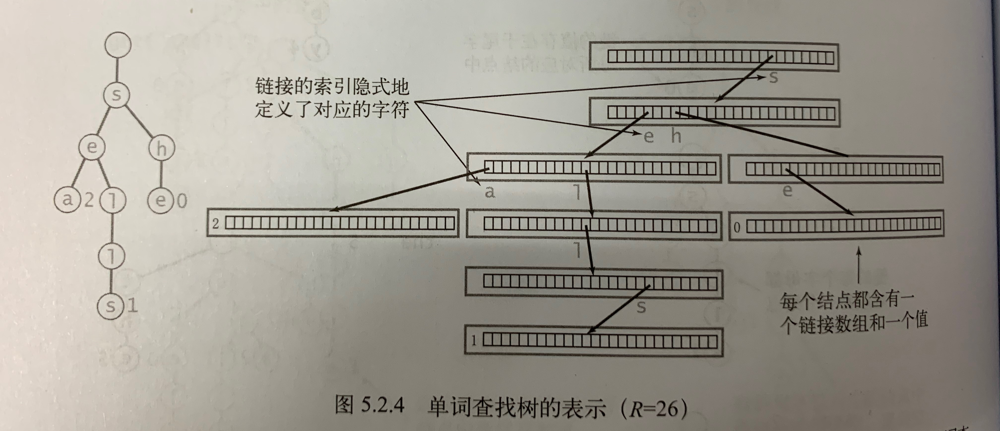

# 208. 实现Trie树（前缀树）

## 题目  
实现一个 Trie (前缀树)，包含 insert, search, 和 startsWith 这三个操作。

示例:

    Trie trie = new Trie();

    trie.insert("apple");
    trie.search("apple");   // 返回 true
    trie.search("app");     // 返回 false
    trie.startsWith("app"); // 返回 true
    trie.insert("app");   
    trie.search("app");     // 返回 true
说明:

你可以假设所有的输入都是由小写字母 a-z 构成的。
保证所有输入均为非空字符串。

## 方法
Trie树又叫前缀树又叫单词查找树，它的每个节点既不包含字符串，也不包含字符串中的某一个字符，它仅保存一个链接数组和一个boolean类型的值isEnd（标记是否有字符串以它结尾）。



以本题为例，一个节点会有26个子节点。  
**一个节点表示的字符是c，等价于这个节点与字符c对应的子节点非空**

### Trie树的插入
```java
public void insert(String word){
    TrieNode node = root;
    for(char c : word.toCharArray()){
        //如果没有字符c，就建立与字符c对应的节点
        if(node.next[c - 'a'] == null)
            node.next[c - 'a'] = new TrieNode();
        node = node.next[c - 'a'];
    }
    node.isEnd = true;
}
```

### Trie树的查找
从根节点的子节点开始一直向下匹配字符串中的字符c，如果出现null说明匹配失败，返回false。如果匹配到了最后一个字符，说明该字符串的所有字符都能在Trie树中匹配，这是只需检查字符串是否以当前node结尾即可。（例如，word为"sea",Trie树中含有字符串"seal",那么即使sea这三个字符都能在Trie树中匹配成功，但是a对应的节点的isEnd为false，那么依然匹配失败）
```java
public boolean search(String word){
    TrieNode node = root;
    for(char c : word.toCharArray()){
        node = node.next[c - 'a'];
        if(node == null)
            return false;
    }
    return node.isEnd;
}
```

### Tire树的前缀匹配
大体上和search操作类似，只是无需判断最后一个字符对应节点的isEnd。因为既然能遍历到最后一个字符，说明前面的字符都匹配成功，Trie树中一定有单词是以该字符串为前缀的。

例如上面的例子:匹配完字符串"sea",说明sea着三个字符都在Trie树中匹配成功，那么不管a是否是一个Trie树中字符串的结尾，都返回True。（因为Trie中虽没有sea，但有以它为前缀的seal）
```java
public boolean startsWith(String prefix){
    TrieNode node = root;
    for(char c : prefix.toCharArray()){
        node = node.next[c - 'a'];
        if(node == null)
            return false;
    }
    return true;
}
```

### Trie树的大小
```java
//以x为根节点的单词查找树中的单词个数
public int size(TrieNode x){
    if(x == null)
        return 0;
    int count = 0;
    if(x.isEnd)
        count++;
    for(char c = 0; c < 26; c++)
        count += size(x.next[c]);
    return count;
}
```

### 全部代码
```java
public class Trie {
    private TrieNode root;
    private class TrieNode{
        private boolean isEnd;
        private TrieNode[] next;

        private TrieNode(){
            isEnd = false;
            next = new TrieNode[26];
        }
    }

    public Trie(){
        root = new TrieNode();
    }

    public void insert(String word){
        TrieNode node = root;
        for(char c : word.toCharArray()){
            if(node.next[c - 'a'] == null)
                node.next[c - 'a'] = new TrieNode();
            node = node.next[c - 'a'];
        }
        node.isEnd = true;
    }

    public boolean search(String word){
        TrieNode node = root;
        for(char c : word.toCharArray()){
            node = node.next[c - 'a'];
            if(node == null)
                return false;
        }
        return node.isEnd;
    }

    public boolean startsWith(String prefix){
        TrieNode node = root;
        for(char c : prefix.toCharArray()){
            node = node.next[c - 'a'];
            if(node == null)
                return false;
        }
        return true;
    }

    //以x为根节点的单词查找树中的单词个数
    public int size(TrieNode x){
        if(x == null)
            return 0;
        int count = 0;
        if(x.isEnd)
            count++;
        for(char c = 0; c < 26; c++)
            count += size(x.next[c]);
        return count;
    }
}
```

