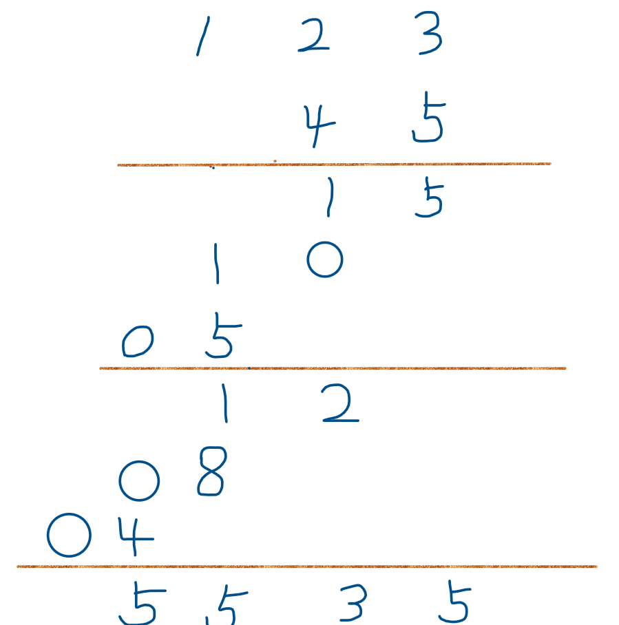

# 43. 字符串相乘

## 题目
给定两个以字符串形式表示的非负整数 num1 和 num2，返回 num1 和 num2 的乘积，它们的乘积也表示为字符串形式。

    示例 1:
    输入: num1 = "2", num2 = "3"
    输出: "6"

    示例 2:
    输入: num1 = "123", num2 = "456"
    输出: "56088"

## 方法
对于这类题目，一定要想到大数溢出的情况。如果给定字符串num1和num2特别长，其自己也许都无法转换成int甚至long类型，更不用说让他们转换后再相乘了。所以这种办法行不通，必须要从对字符串的操作中寻找办法。

我们在小学时就学过字符串相乘，现在我们来回忆一下这个过程：例如对于123*45，我们会这样操作：让123先乘5，得到一个结果，再让123乘4得到另一个结果，两个结果相加即为乘法的结果。但如果123乘5这一步，如果数很大的话，还是可能溢出。因此我们的计算过程需要再简单一点，如下所示：



即：我们将num1和num2的每一个字符进行相乘，再错位进行相加得到结果。
这一用人类思维方式表示的计算过程，对于计算机来说需要这样组织：  
定义两个指针i和j，分别指向num1和num2上的某一位置上的字符，计算这两个字符串的乘积，同时将乘积叠加到结果数组res上的正确位置（数组res用于在地下接收相加的结果）。

但res上哪个位置是与字符num1[i]和num2[j]的乘积有关的呢？仔细观察上述计算过程就可发现，num1[i]和num2[j]的乘积对应这数组中的i+j位置和i+j+1位置。

## 代码
```java
public String multiply(String num1, String num2) {
    if(num1.charAt(0) == '0' || num2.charAt(0) == '0')
        return "0";
    int len1 = num1.length(), len2 = num2.length();
    //定义结果数组并初始化（结果数组最多有len1+len2位数）
    int[] res = new int[len1 + len2];
    Arrays.fill(res, 0);
    //从num1和num2的个位数开始逐个位相乘
    for(int i = len1 - 1; i >= 0; i--){
        for(int j = len2 - 1; j >= 0; j--){
            //mul为相乘的结果，由于是两个个位数相乘，mul最多为二位数。它的个位和十位分别影响res的i+j+1位和i+j位
            int mul = (num1.charAt(i) - '0') * (num2.charAt(j) - '0');
            int p1 = i + j, p2 = i + j + 1;
            //用mul加上res的i + j + 1位上原有的值后，更新res数组。
            int sum = mul + res[p2];
            res[p2] = sum % 10;
            res[p1] += sum / 10;
        }
    }
    //将结果数组转化为字符串
    String s = "";
    for(int i = 0; i < res.length; i++)
        s += (char)(res[i] + '0');
    //结果字符串前缀可能会有0，需要去掉
    int count = 0;
    while(s.charAt(count) == '0' && count < res.length)
        count++;
    return s.substring(count, s.length());
}
```
