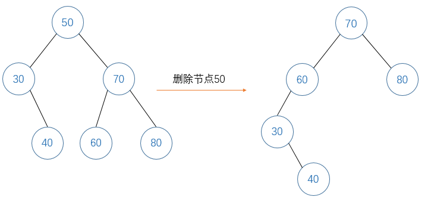

# 450.删除二叉搜索树中的节点

## 题目
给定一个二叉搜索树的根节点 root 和一个值 key，删除二叉搜索树中的 key 对应的节点，并保证二叉搜索树的性质不变。返回二叉搜索树（有可能被更新）的根节点的引用。


    示例:
    root = [5,3,6,2,4,null,7]
    key = 3

        5
       / \
      3   6
     / \   \
    2   4   7

    给定需要删除的节点值是 3，所以我们首先找到 3 这个节点，然后删除它。

    一个正确的答案是 [5,4,6,2,null,null,7], 如下图所示。

        5
       / \
      4   6
     /     \
    2       7

    另一个正确答案是 [5,2,6,null,4,null,7]。

        5
       / \
      2   6
       \   \
        4   7


## 方法
若要在一颗根为root的二叉搜索树中删除值为key的节点，一共有三种情况：
1. key < root.val    
   由于二叉搜索树左子树的节点值都小于根节点，因此值为key的节点一定位于左子树中，我们递归在左子树中删除值为key的节点，并将删除结束后的新的左子树与根节点连接即可。
2. key > root.val  
    由于二叉搜索树右子树的节点值都大于根节点，因此值为key的节点一定位于右子树中，我们递归在右子树中删除值为key的节点，并将删除结束后的新的右子树与根节点连接即可。
3. key = root.val   
   当key与根节点值相等时，意味着要删除的节点正是根节点root自己。于是可以分两种情况讨论：
   * 若root的右子树为空，则要想删除root节点，只需让root的左子树替代它的位置即可。
   * 若root的右子树不为空，由于右子树中最左的节点即为右子树中值最小的节点，root左子树的所有节点都比这个节点小，因此我们只要找到右子树中这个最左的节点，将root的左子树挂到它下面，成为它的左子树即可。如下图所示：将50的左子树挂到50的右子树的最左的节点60下，成为60节点的左子树
  



## 代码
```java
public TreeNode deleteNode(TreeNode root, int key) {
    if(root == null)
        return null;
    //情况一：在root的左子树中删除值为key的节点
    if(key < root.val){
        TreeNode L = deleteNode(root.left, key);
        root.left = L;
    }
    //情况二：在root的右子树中删除值为key的节点
    else if(key > root.val){
        TreeNode R = deleteNode(root.right, key);
        root.right = R;
    }
    //情况三：删除root节点自身
    else{
        if(root.right == null)
            return root.left;
        else{
            //用cur找到root右子树中最左的节点
            TreeNode cur = root.right;
            while(cur.left != null)
                cur = cur.left;
            //将root的左子树挂到这个节点之下
            cur.left = root.left;
            return root.right;
        }
    }
    return root;
}
```