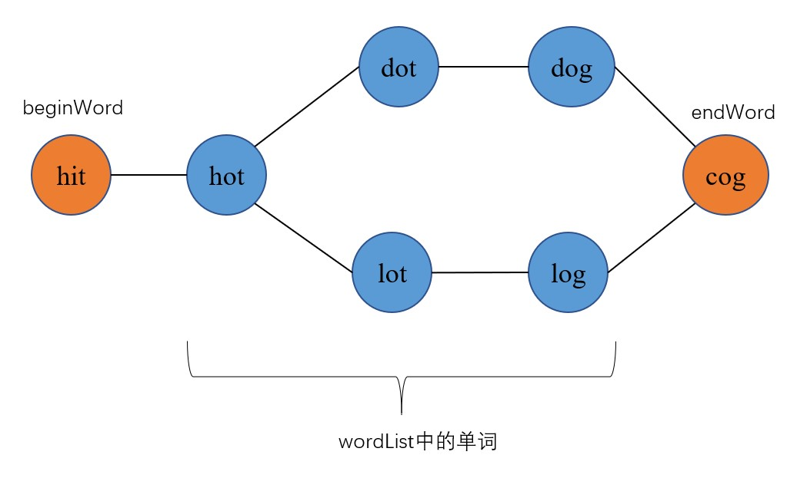

# 127.单词接龙


## 题目
给定两个单词（beginWord 和 endWord）和一个字典，找到从 beginWord 到 endWord 的最短转换序列的长度。转换需遵循如下规则：

每次转换只能改变一个字母。
转换过程中的中间单词必须是字典中的单词。

说明:
* 如果不存在这样的转换序列，返回 0。
* 所有单词具有相同的长度。
* 所有单词只由小写字母组成。
* 字典中不存在重复的单词。
* 你可以假设 beginWord 和 endWord 是非空的，且二者不相同。


示例：

    示例 1:
    输入:
    beginWord = "hit",
    endWord = "cog",
    wordList = ["hot","dot","dog","lot","log","cog"]
    输出: 5
    解释: 一个最短转换序列是 "hit" -> "hot" -> "dot" -> "dog" -> "cog",返回它的长度 5。

    示例 2:
    输入:
    beginWord = "hit"
    endWord = "cog"
    wordList = ["hot","dot","dog","lot","log"]
    输出: 0
    解释: endWord "cog" 不在字典中，所以无法进行转换。


## 方法（广度优先遍历）
我们可以把beginWord、endWord还有wordList中的所有单词想象成一张无向图中的节点。如果两个单词只有一个字符不同，则这两个节点相连。



因此题意就变为了：在beginWord到endWord两个节点间，找到一条最短路径。我们由“最短”想到了广度优先遍历。

要进行BFS，我们需要两个复制结构：
* 一个队列
* 一个visited数组(或集合)，记录一个节点有没有被BFS遍历过，以避免重复遍历造成在图中无限循环。

注意：对于树的BFS只需要一个队列即可，因为树从上到下的结构决定了不会在其中重复遍历。


## 代码
```java
public int ladderLength(String beginWord, String endWord, List<String> wordList) {
    //将wordList中的单词加入HashSet，以便我们在之后快速查询一个单词是否在字典中
    Set<String> set = new HashSet<>(wordList);
    //如果字典中有beginWord，先要把它删掉
    if(set.contains(beginWord))
        set.remove(beginWord);
    Queue<String> queue = new LinkedList<>();
    //uesd集合记录哪些字符串已经在BFS中被遍历过
    Set<String> used = new HashSet<>();
    queue.add(beginWord);
    used.add(beginWord);
    int step = 0;
    //进入BFS流程
    while(!queue.isEmpty()){
        int size = queue.size();
        step++;
        for(int i = 0; i < size; i++){
            String str = queue.poll();
            //如果找到了endWord，直接返回
            if(str.equals(endWord))
                return step;
            //依次尝试将str中的每一个字符修改为a到z中的一个，看看字典中有没有相应字符
            for(int j = 0; j < str.length(); j++){
                for(int k = 'a'; k <= 'z'; k++){
                    char[] arr = str.toCharArray();
                    arr[j] = (char)k;
                    String new_str = new String(arr);
                    if(set.contains(new_str) && !used.contains(new_str)){
                        queue.add(new_str);
                        used.add(new_str);
                    }
                }
            }
        } 
    }
    return 0;
}
```