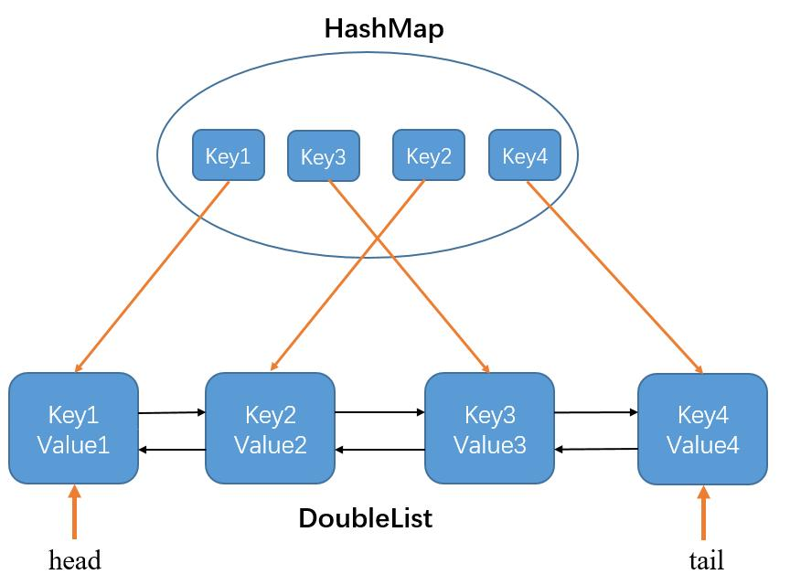

# 146. LRU缓存机制

## 题目

运用你所掌握的数据结构，设计和实现一个  LRU (最近最少使用) 缓存机制。它应该支持以下操作： 获取数据 get 和 写入数据 put 。

获取数据 get(key) - 如果关键字 (key) 存在于缓存中，则获取关键字的值（总是正数），否则返回 -1。
写入数据 put(key, value) - 如果关键字已经存在，则变更其数据值；如果关键字不存在，则插入该组「关键字/值」。当缓存容量达到上限时，它应该在写入新数据之前删除最久未使用的数据值，从而为新的数据值留出空间。

进阶:
你是否可以在 O(1) 时间复杂度内完成这两种操作？

示例:

    LRUCache cache = new LRUCache( 2 /* 缓存容量 */ );
    cache.put(1, 1);
    cache.put(2, 2);
    cache.get(1);       // 返回  1
    cache.put(3, 3);    // 该操作会使得关键字 2 作废
    cache.get(2);       // 返回 -1 (未找到)
    cache.put(4, 4);    // 该操作会使得关键字 1 作废
    cache.get(1);       // 返回 -1 (未找到)
    cache.get(3);       // 返回  3
    cache.get(4);       // 返回  4

## 方法
题目要求我们构建一个数据结构，并实现两种API：put操作和get操作，因为要在O(1)时间复杂度内完成这两种操作，所以这一数据结构要求满足以下几个特点：**插入快、查找快、删除快、并且有序**（因为需要有序来区分最近使用的和久未使用的数据）。

考虑我们学过的数据结构，链表可以做到有序，插入和删除也快，但是查找操作很慢。哈希表的插入查找删除都为O(1),但是不能做到有序。因此将两个结构相结合，构成哈希链表，即可同时拥有以上特性。

因此，我们需要同时维护一个哈希表和一个双向链表，双向链表的节点中存放数据结构Node（包括key和value），哈希表的键为key，值为存放这个key的Node节点。如下图所示：



Node类如下：
```java
class Node{
    private int key, value;
    private Node next, pre;
    public Node(int k, int v){
        this.key = k;
        this.value = v;
    }
}
```

双向链表DoubleList类如下（包括4个时间复杂度均为O(1)的实例方法）：
```java
class DoubleList{
    private Node head, tail;
    private int size;

    //在双向链表头部添加节点x
    public void addFirst(Node x){
        //先处理向空链表中加入节点的情况
        if(head == null)
            head = tail = x;
        else {
            x.next = head;
            head.pre = x;
            head = x;
        }
        size++;
    }
    //删除链表中的x节点
    public void remove(Node x){
        if(x == head && x == tail){
            head = null;
            tail = null;
        }
        else if(x == tail){
            x.pre.next = null;
            tail = x.pre;
        }
        else if(x == head){
            x.next.pre = null;
            head = x.next;
        }
        else {
            x.pre.next = x.next;
            x.next.pre = x.pre;
        }
        size--;
    }
    //删除并返回双向链表的最后一个节点
    public Node removeLast(){
        Node node = tail;
        remove(tail);
        return node;
    }
    //返回双向链表的长度
    public int size(){
        return size;
    }
}
```

有了以上两个结构，我们在LRU算法中将哈希表和双向链表结合起来即可，就可以在实现LRU算法的同时，将get和put这两操作的时间复杂度控制在O(1)
```java
class LRUCache {
    //哈希表的键为key，值为key对应的Node节点（包含key和value）
    private HashMap<Integer, Node> map;
    private DoubleList cache;
    private int capacity;

    public LRUCache(int capacity){
        this.capacity = capacity;
        map = new HashMap<>();
        cache = new DoubleList();
    }

    public int get(int key){
        if(!map.containsKey(key))
            return -1;
        int value = map.get(key).value;
        put(key, value);
        return value;
    }

    public void put(int key, int value){
        Node x = new Node(key, value);
        //如果结构中本来有此key，则删除掉旧的节点，并把新的插到头部，然后更新map
        if(map.containsKey(key)){
            cache.remove(map.get(key));
            cache.addFirst(x);
            map.put(key, x);
        }
        //如果结构中原来没有此key
        else{
            //如果容量已满，那么需要先删除尾部的节点，然后再将x添加到头部，同时更新map
            if(capacity == cache.size()){
                Node last = cache.removeLast();
                map.remove(last.key);
            }
            cache.addFirst(x);
            map.put(key, x);
        }
    }
}
```

